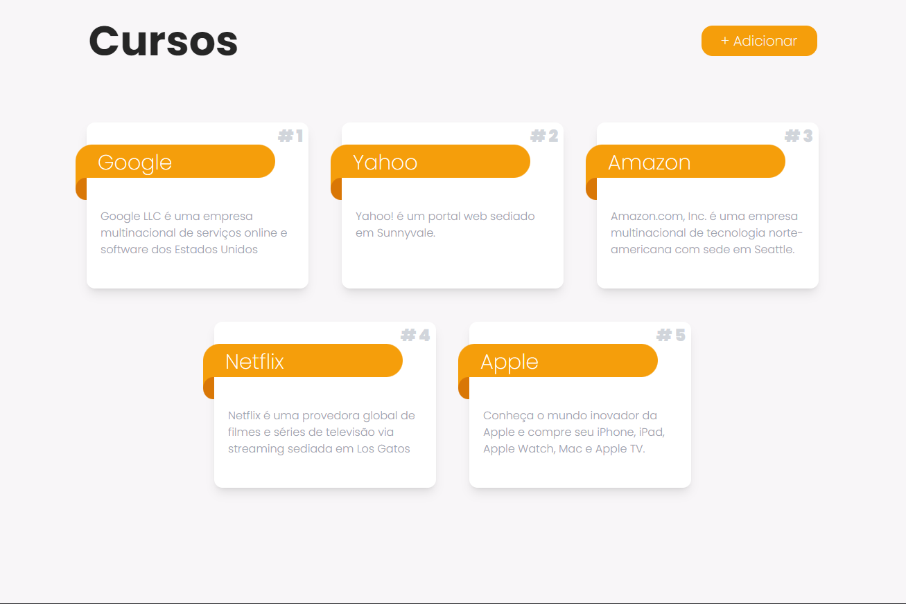

<h1 align="center">Courses Web</h1>

<div align="center">
   Hospedado no Heroku: <a href="https://courses-crud-web.herokuapp.com/" target="_blank">Demo</a>.
</div>

<div align="center">
  <h3>
    <a href="https://github.com/iDallek/courses-crud-api">
      API
    </a>
    <span> | </span>
    <a href="https://github.com/iDallek/courses-mobile">
      MOBILE
    </a>
  </h3>
</div>

## Overview



> Aplicação ReactJs CRUD para cadastro, alteração e remoção de cursos.

### Principais Stacks

- [React](https://reactjs.org/)
- [Tailwind](https://tailwindcss.com/)

## 🚀 Iniciando localmente

<!-- Example: -->

Para clonar e executar este aplicativo, você precisará do [Git](https://git-scm.com) e do [Node.js](https://nodejs.org/en/download/) (que vem com [ npm](http://npmjs.com)) instalado em seu computador. Em seu terminal:

```bash
# Clonar esse repositório
$ git clone git@github.com:iDallek/courses-web.git

# Instalar as dependências
$ npm install

# Inicie o app
$ npm start
```
